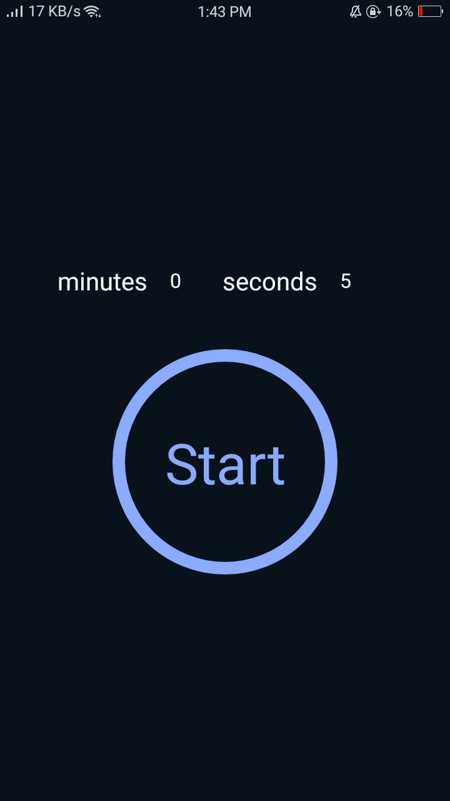
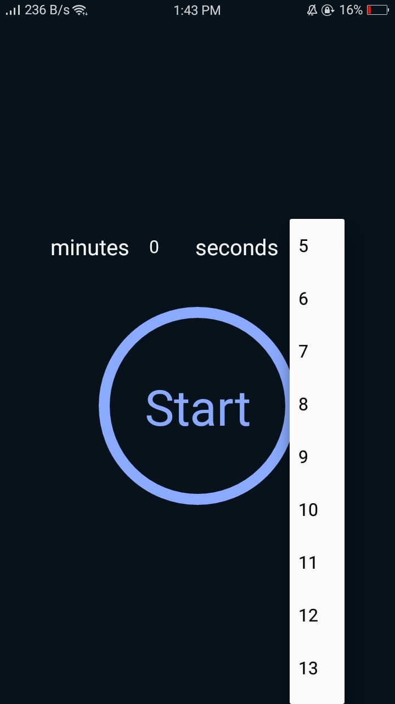
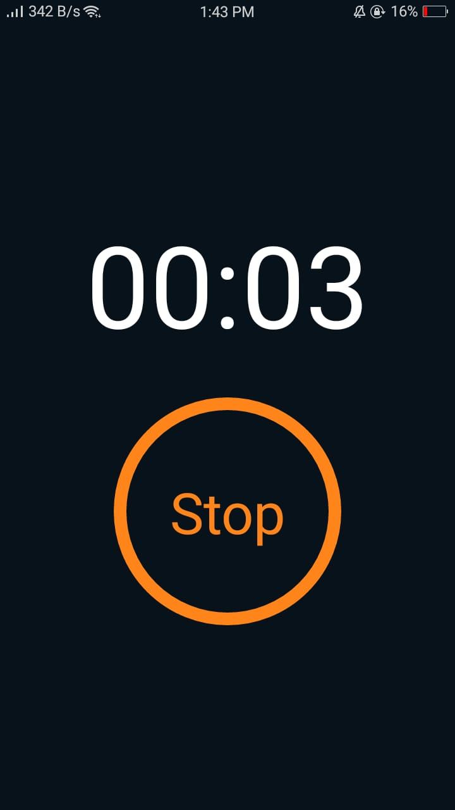

## React Native Timer App

A simple cross platform (iOS and Android) React Native timer app.

 

### Installation

- `git clone https://github.com/MuhammadIsmail-Dev/react-native-timer-app`
- `yarn install`/`npm install`

### Running

- `yarn run ios`/`npm run ios` or `yarn run android`/`npm run android`
